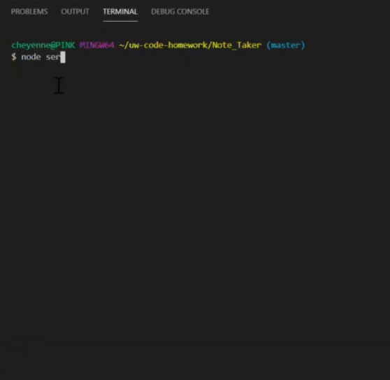
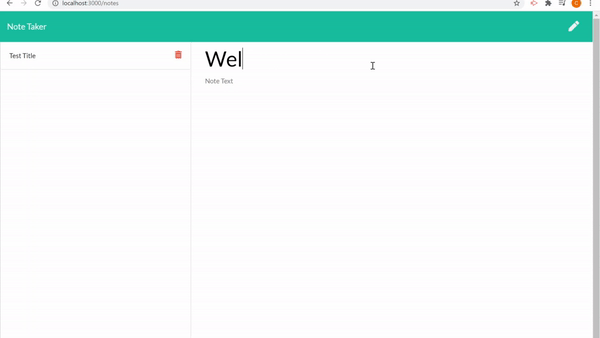
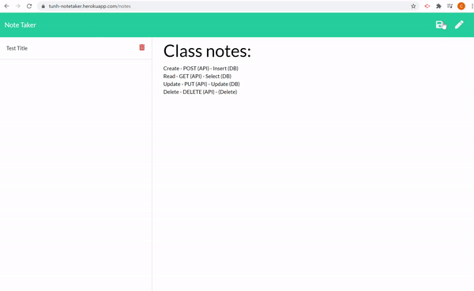

# Note_Taker

## Demo

Running my app on my local server before deploying to Heroku 

App running on local server 3000

## Table of contents

- [General info](#general-info)
- [Technologies](#Technologies)
- [Summary](#Summary)
- [Usage](#Usage)
- [Expectations](#Expectations)
- [Author](#Author)
- [License](#License)

## General info

CLI app deployed on Heroku that allows you to "SAVE" and "DELETE" notes to help keep track
of your day!

## Technologies

- [JavaScript](https://www.javascript.com/)
- [Node.js](https://nodejs.org/)
- [Heroku](https://id.heroku.com/login)
- [package.json](https://docs.npmjs.com/creating-a-package-json-file)
- [express](https://expressjs.com/)
## Summary

## Usage

## Expectations

App deployed on Heroku 
Link: (https://tunh-notetaker.herokuapp.com/)

## Author

Cheyenne Hunt

## License

Open Source